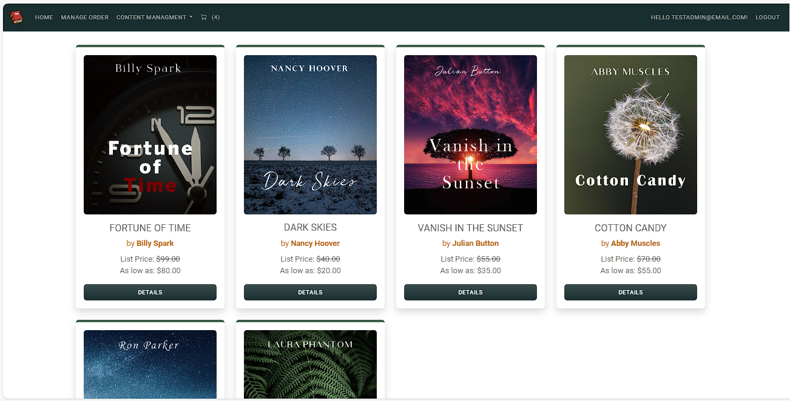

# Bulky Book E-Commerce Website

Bulky Book Web is an  E-Commerce website built using ASP.NET Core MVC (.NET 8).

## Main features/functionality of the web application as follows:

- User Registration for different users (Admin, Customers, Company, Employee)
- N-Tier architecture 
- Repository Pattern
- User Authentications and Authorizations
- Two-Factory Authentication with Facebook
- Notify Customers of the products shipping status
- Stripe Payment Gateway

## Screenshots

## Tech Stack

**Client:** HTML, CSS, JavaScript

**Server:** C#, .Net MVC, SQL Server, Entity Framework

